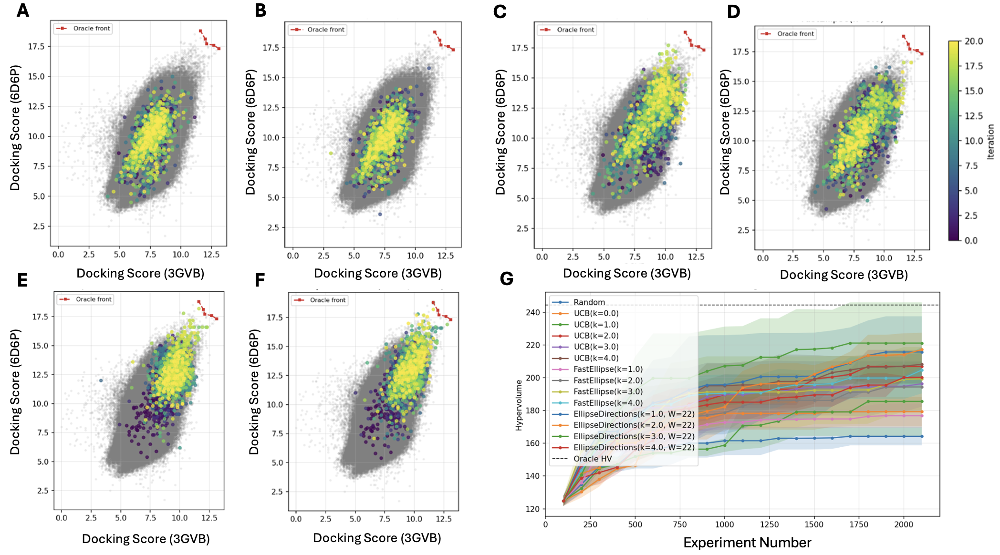

# multiobjective-drug-design

## Overview

This project focuses on evaluating and optimizing multi-objective optimization strategies based on Pareto front methods within an active learning framework.

The methodology is applied to molecular docking results, with the goal of improving candidate selection under multiple competing objectives. We investigate how different optimization approaches influence the balance between exploration and exploitation, as well as the overall quality of selected compounds.

The project aims to support more efficient and informed decision-making in computational drug discovery workflows.

## PiAL data and multilabel model

PiAL reads the shared data in place; these files must not be copied or moved into this repository:

- `/net/storage/pr3/plgrid/plggsanodrugs/pial/data/dataset.h5` contains the molecular input data used by the pipeline.
- `/net/storage/pr3/plgrid/plggsanodrugs/pial/data/initial_datasets/` contains the initial labeled sets for the Active Learning seeds.
- `/net/storage/pr3/plgrid/plggsanodrugs/pial/data/pareto_dimensions.parquet` contains the three aggregated Pareto dimensions, including the selected and remaining interaction counts.
- `/net/storage/pr3/plgrid/plggsanodrugs/pial/docking/data/ampc_1L2S_B_training_PLIF.parquet` contains the full binary PLIF source vectors.
- `/net/storage/pr3/plgrid/plggsanodrugs/pial/data/pareto_plif_feature_mapping.tsv` defines the aggregation and the split into 8 selected and 48 remaining PLIF features.

The current PiAL predictor uses a shared ECFP encoder and three task-specific heads:

- `docking_head`: one regression output trained against `-docking_score`;
- `selected_head`: 8 logits for the selected/pocket PLIF features;
- `remaining_head`: 48 logits for the remaining PLIF features.

Training uses equally weighted losses: `MSELoss` for docking and `BCEWithLogitsLoss` for each multilabel interaction head (`MSE + BCE + BCE`, weights `1:1:1`). The two interaction heads predict individual binary PLIF targets rather than scalar interaction counts.

For the existing three-dimensional acquisition interface, inference applies sigmoid to the interaction logits and aggregates expected counts:

```text
selected_mean_count = sigmoid(selected_logits).sum(dim=1)
remaining_mean_count = sigmoid(remaining_logits).sum(dim=1)
```

This preserves the acquisition objectives `(docking, selected count, remaining count)` without changing UCB, HV/HVI, or ellipse acquisition implementations. MC dropout supports the multilabel model and exposes the existing `(means, stds, covs)` contract after count aggregation. Last-Layer Laplace is deliberately blocked for this architecture until a posterior implementation for the multilabel heads is added; it fails explicitly instead of silently returning incompatible uncertainty.

## PiAL roadmap

- Analyze class imbalance across the 8 + 48 PLIF targets and evaluate `pos_weight` if needed.
- Tune MLP hyperparameters with fixed data splits, seeds, targets, and normalization.
- Implement Last-Layer Laplace for the multilabel selected and remaining heads.
- Compare UCB variants for aggregated interaction probabilities/counts.


## Complexity and Time Benchmark on Synthetic Data

To evaluate the computational complexity and runtime behavior of the considered methods, synthetic datasets with controlled structure were generated. A total of (N = 10 000) samples were drawn in a five-dimensional space and subsequently projected onto lower dimensions (d in {2, 3, 4, 5}).

For each point, vectors of means and standard deviations were sampled from a normal distribution. A fixed initial subset of 100 points (seed) was used to initialize the Pareto front. The experiments were then conducted on candidate pools of increasing size (N in {1000, 2000, 3000, 5000, 10000}), ensuring that all compared methods operated on identical input data. Each measurement corresponds to a single iteration of the selection procedure.

The UCB method relies solely on mean and standard deviation values and operates directly on the Pareto front defined in the given dimension. The EllipsoidFast and EllipsoidDirection methods additionally account for the computational cost associated with covariance matrix estimation.

The results (Figure 1) reveal clear differences in scalability. The EllipsoidDirection method exhibits stable runtime that does not increase with dimensionality, with empirical complexity below linear (alpha ≈ 0.85).

In contrast, both UCB and EllipsoidFast demonstrate linear scaling with respect to the number of points (alpha = 1), but their total runtime increases significantly with dimensionality. This is primarily due to the need to compute hypervolume (HV) contributions relative to the Pareto front for both dominating and non-dominating points, which becomes increasingly expensive in higher dimensions.

## Complexity and time results

We evaluate the runtime and scalability of the considered methods on synthetic datasets with controlled structure.

The left plot shows how execution time grows with the number of candidates, while the right plot illustrates the impact of dimensionality.

EllipsoidDirection (E-Dir) consistently achieves the lowest runtime and exhibits sublinear scaling. In contrast, UCB and EllipsoidFast (E-Fast) scale approximately linearly and incur significantly higher computational cost.

As dimensionality increases, UCB and E-Fast show a sharp rise in runtime due to the cost of hypervolume computations, whereas E-Dir remains stable and largely independent of the number of objectives.

Overall, EllipsoidDirection provides the best scalability and computational efficiency, particularly in higher-dimensional settings.


***Figure 1:** Runtime scaling with respect to candidate pool size (left) and dimensionality (right).*

## 2D Multi-Target Optimization Results

In the two-objective docking setting, the goal is to identify optimal candidate molecules defined by the Pareto front. Among the evaluated strategies, the Ellipse Direction method achieves solutions closest to the optimal trade-off, demonstrating superior efficiency in navigating the chemical space and converging toward high-quality candidates.



*Figure 2.* Comparison of exploration strategies in the chemical space across two molecular targets (3GVB and 6D6P), shown against the full candidate space (gray points): random sampling (A), Upper Confidence Bound (UCB) (B–C), and the proposed methods: covariance-based Pareto front exploration (D) and directional multi-objective acquisition (E–F). These methods leverage a geometric approximation of model uncertainty in the form of covariance ellipsoids to guide the selection of new docking candidates. Color indicates the iteration of selection. Panel G shows the hypervolume growth of the Pareto front as the number of docking evaluations increases.

## 3D Multi-Target Optimization Results


**Figure:** Evolution of the Pareto front during optimization across three molecular objectives.*

This animation illustrates the incremental growth of the Pareto front in a three-objective optimization setting. Each step reflects the selection process within the active learning loop, where new candidates are added based on multi-objective criteria.

The visualization highlights how the method progressively explores the objective space while improving the diversity and quality of selected compounds across all three molecular targets.
