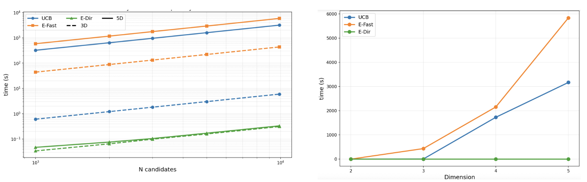
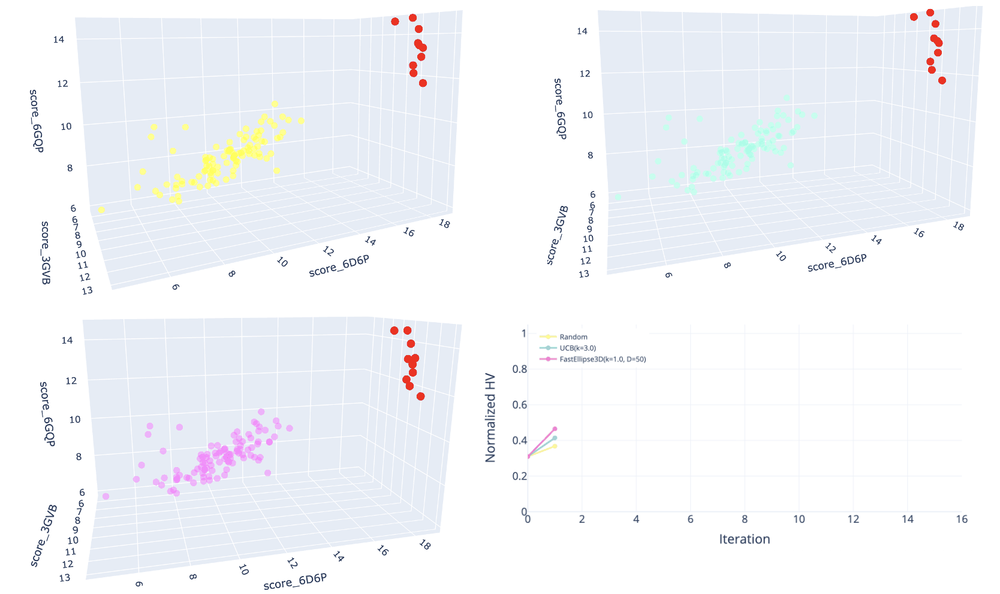

# pareto-al

## Overview

This project focuses on evaluating and optimizing multi-objective optimization strategies based on Pareto front methods within an active learning framework.

The methodology is applied to molecular docking results, with the goal of improving candidate selection under multiple competing objectives. We investigate how different optimization approaches influence the balance between exploration and exploitation, as well as the overall quality of selected compounds.

The project aims to support more efficient and informed decision-making in computational drug discovery workflows.

## Complexity and Time Benchmark on Synthetic Data

To evaluate the computational complexity and runtime behavior of the considered methods, synthetic datasets with controlled structure were generated. A total of (N = 10 000) samples were drawn in a five-dimensional space and subsequently projected onto lower dimensions (d in {2, 3, 4, 5}).

For each point, vectors of means and standard deviations were sampled from a normal distribution. A fixed initial subset of 100 points (seed) was used to initialize the Pareto front. The experiments were then conducted on candidate pools of increasing size (N in {1000, 2000, 3000, 5000, 10000}), ensuring that all compared methods operated on identical input data. Each measurement corresponds to a single iteration of the selection procedure.

The UCB method relies solely on mean and standard deviation values and operates directly on the Pareto front defined in the given dimension. The EllipsoidFast and EllipsoidDirection methods additionally account for the computational cost associated with covariance matrix estimation.

The results (Figure 1) reveal clear differences in scalability. The EllipsoidDirection method exhibits stable runtime that does not increase with dimensionality, with empirical complexity below linear (alpha ≈ 0.85).

In contrast, both UCB and EllipsoidFast demonstrate linear scaling with respect to the number of points (alpha = 1), but their total runtime increases significantly with dimensionality. This is primarily due to the need to compute hypervolume (HV) contributions relative to the Pareto front for both dominating and non-dominating points, which becomes increasingly expensive in higher dimensions.

## Benchmark Results

*Figure 1: Runtime scaling with respect to candidate pool size (left) and dimensionality (right).*

We evaluate the runtime and scalability of the considered methods on synthetic datasets with controlled structure.

The left plot shows how execution time grows with the number of candidates, while the right plot illustrates the impact of dimensionality.

EllipsoidDirection (E-Dir) consistently achieves the lowest runtime and exhibits sublinear scaling. In contrast, UCB and EllipsoidFast (E-Fast) scale approximately linearly and incur significantly higher computational cost.

As dimensionality increases, UCB and E-Fast show a sharp rise in runtime due to the cost of hypervolume computations, whereas E-Dir remains stable and largely independent of the number of objectives.

Overall, EllipsoidDirection provides the best scalability and computational efficiency, particularly in higher-dimensional settings.

## 3D Multi-Target Optimization Results

*Figure: Evolution of the Pareto front during optimization across three molecular objectives.*

This animation illustrates the incremental growth of the Pareto front in a three-objective optimization setting. Each step reflects the selection process within the active learning loop, where new candidates are added based on multi-objective criteria.

The visualization highlights how the method progressively explores the objective space while improving the diversity and quality of selected compounds across all three molecular targets.
